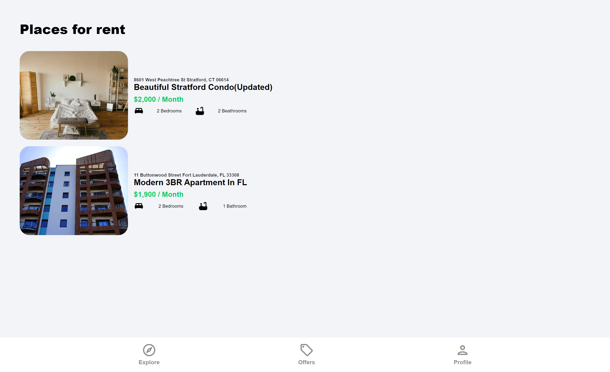

# House Marketplace

> eCommerce platform built with the Django and React stack & Redux.

- [Features](#features)
- [Usage](#usage)
  - [Env Variables](#env-variables)
  - [Install Dependencies (frontend & backend)](#install-dependencies-frontend--backend)
  - [Run](#run)
- [Photos](#photos)

<!-- tocstop -->

## Features

- Rent, sell and offer type of listings
- Top listings carousel
- Contact with landlord
- User profile first_name, last_name and email and add, edit, delete with own listins action
- Sign up with email confirmation sign in and logout
- Reset password and reset password confirmation

### Install Dependencies (frontend & backend)

```
pip install -r requirements.txt
cd frontend
npm install
```

### Run

```

# Run frontend (:3000) & backend (:5000)
python manage.py runserver
```

## Build & Deploy

```
# Create frontend prod build
cd frontend
npm run build
```

---

## Photos





